# AOI Anomaly Inspector

Industrial Automated Optical Inspection (AOI) pipeline supporting **PaDiM** and **PatchCore** models, outputting **OK/NG decisions** and **defect localization** results.

Developed on the [MVTec AD](https://www.mvtec.com/company/research/datasets/mvtec-ad) dataset, enables one-click inference on any image folder with overlay visualizations, defect masks, and structured JSON reports.

## Model Comparison

### Metrics Comparison (transistor)

| Metric | PaDiM | PatchCore |
|--------|-------|-----------|
| **Image AUROC** | 0.9108 | **0.9954** |
| **Pixel AUROC** | **0.9685** | 0.9607 |
| **Pixel AUPRO** | 0.8377 | **0.9356** |

- **Image Size**: 256×256
- **Device**: CPU
- **Backbone**: ResNet-18 (layer2, layer3)

> **Conclusion**: PatchCore performs better in image-level detection (Image AUROC) and localization quality (AUPRO); PaDiM has a slight advantage in pixel-level segmentation (Pixel AUROC).

### Sample Visualizations

The figures below show anomaly heatmap comparisons (overlays) of the two models on the same images. Left column is PaDiM, right column is PatchCore.

#### Good Samples

<table>
<tr>
<th>PaDiM</th>
<th>PatchCore</th>
</tr>
<tr>
<td>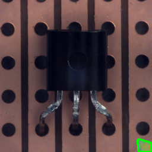</td>
<td></td>
</tr>
<tr>
<td>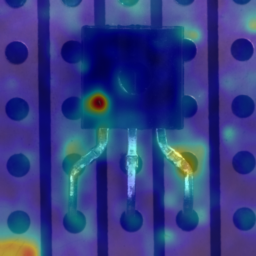</td>
<td>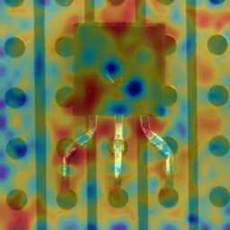</td>
</tr>
</table>

#### Defect Samples

<table>
<tr>
<th>Defect Type</th>
<th>PaDiM</th>
<th>PatchCore</th>
</tr>
<tr>
<td>bent_lead (Mild)</td>
<td>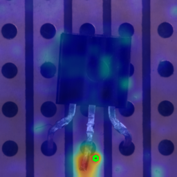</td>
<td>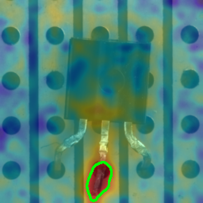</td>
</tr>
<tr>
<td>cut_lead (Mild)</td>
<td>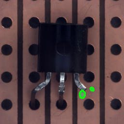</td>
<td>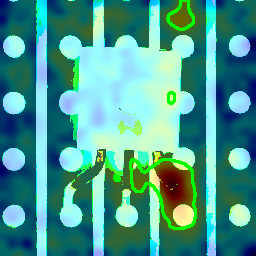</td>
</tr>
<tr>
<td>damaged_case (Medium)</td>
<td>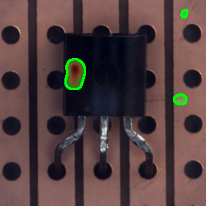</td>
<td>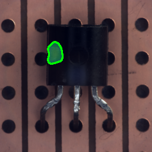</td>
</tr>
<tr>
<td>misplaced (Medium)</td>
<td>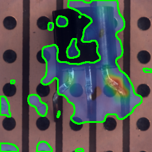</td>
<td>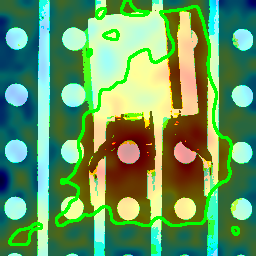</td>
</tr>
<tr>
<td>bent_lead (Severe)</td>
<td>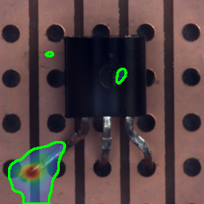</td>
<td>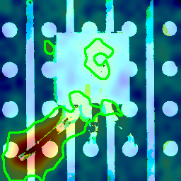</td>
</tr>
<tr>
<td>cut_lead (Severe)</td>
<td>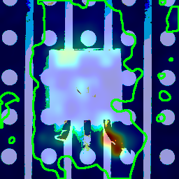</td>
<td>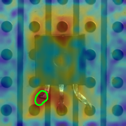</td>
</tr>
</table>

---

## Quick Start

### Environment

Use `uv` to manage dependencies (see `pyproject.toml` / `uv.lock`):

```bash
uv sync
uv pip install -e .
```

If you prefer `pip`:

```bash
pip install -e .
```

All scripts import the `aoi` package, so an editable install is required for a fresh checkout.

## Dataset

Organized by default according to anomalib's MVTec AD directory structure, with `datasets/mvtech/` pointing to the dataset root directory in the repository (which you have already downloaded and verified).

Directory structure should look like:

```text
datasets/mvtech/
  transistor/
    train/good/*.png
    test/<defect>/*.png
    ground_truth/<defect>/*.png
```

Quick check (will generate `preview.png`):

```bash
python scripts/check_data.py
```

## Training

### PaDiM

```bash
python scripts/train.py --config configs/padim_mvtec.yaml --run_id padim_transistor_001 --device cpu
```

### PatchCore

```bash
python scripts/train.py --config configs/patchcore_mvtec.yaml --run_id patchcore_transistor_001 --device cpu
```

Common override parameters (applicable to both models):

```bash
python scripts/train.py --config <cfg.yaml> --category transistor --data_root datasets/mvtech --device cpu --run_id <id>
```

## Evaluation and Thresholds

Recalculate metrics and generate thresholds for a specific run directory:

```bash
# Calculate metrics.json (Image AUROC / Pixel AUROC / Pixel AUPRO)
python scripts/evaluate.py --run_dir runs/padim/transistor/smoke_padim2 --device cpu

# Also generate thresholds.json (for OK/NG decision making)
python scripts/evaluate.py --run_dir runs/padim/transistor/smoke_padim2 --device cpu --compute-thresholds
```

Pixel AUPRO uses anomalib's public metric API; if it's unavailable in your installed anomalib version, the value will be `null`.

### Threshold Strategy

| Threshold | Purpose | Calculation Method |
|-----------|---------|-------------------|
| `image_threshold` | OK/NG Decision | 99.5th percentile of training set image scores |
| `pixel_threshold` | Defect Mask Generation | 99.9th percentile of training set anomaly map values |

> Threshold comparison uses raw values (non-normalized); normalization is used only for visualization.

## Inference (Generate overlay / mask / JSON)

```bash
python scripts/predict.py --run_dir runs/padim/transistor/smoke_padim2 --device cpu --pixel-threshold-mult 3.0
```

Use `--pixel-threshold-mult` to adjust sensitivity for cleaner masks (Recommended: `3.0` for PaDiM, `1.2` for PatchCore).

Output to `<run_dir>/predictions/`:
- `preds.jsonl`: Structured prediction results for each image
- `masks/`: Binary defect masks (when `--save-masks`)
- `overlays/`: Heatmap overlay visualizations (when `--save-overlays`)

Overlays are generated from the model input tensor; values are normalized to `0..255` for visualization.

## AOI Runner (One-Click Inference on Any Folder)

```bash
python scripts/aoi_runner.py \
  --input_dir <your_images/> \
  --output_dir outputs/demo \
  --model_dir runs/patchcore/transistor/smoke_patchcore2 \
  --device cpu \
  --pixel-threshold-mult 1.2
```

### Output Directory Structure

```text
outputs/demo/
  overlays/       # Heatmap overlay visualizations
  masks/          # Binary defect masks
  preds.jsonl     # Structured predictions for each image
  report.json     # Summary report
```

### preds.jsonl Field Description

```json
{
  "image_path": "path/to/image.png",
  "model": "patchcore",
  "category": "transistor",
  "image_size": [256, 256],
  "gt_label": 1,
  "pred_score": 25.67,
  "image_threshold": 12.02,
  "pixel_threshold": 10.75,
  "label": "NG",
  "is_anomaly": true,
  "num_defects": 3,
  "total_defect_area": 1250,
  "defects": [
    {
      "component_id": 1,
      "area": 800,
      "bbox": [50, 60, 120, 150],
      "centroid": [85.5, 105.2],
      "max_anomaly_value": 25.67,
      "mean_anomaly_value": 18.34
    }
  ],
  "mask_path": "masks/000001_image.png",
  "overlay_path": "overlays/000001_image.png"
}
```

`mask_path` and `overlay_path` are omitted when the corresponding outputs are not saved.

### report.json Field Description

```json
{
  "model": "patchcore",
  "category": "transistor",
  "run_id": "smoke_patchcore2",
  "thresholds": {
    "image_threshold": 12.02,
    "pixel_threshold": 10.75
  },
  "num_images": 100,
  "num_ok": 40,
  "num_ng": 60,
  "ng_rate": 0.60,
  "ok_rate": 0.40,
  "created_at": "2026-01-29T15:00:00Z"
}
```

If `preds.jsonl` is empty, counts are zero and rates are `0.0`.

## Model Comparison Script

Generate comparison tables and sample visualizations:

```bash
python scripts/compare_models.py \
  --run_dir_a runs/padim/transistor/smoke_padim2 \
  --run_dir_b runs/patchcore/transistor/smoke_patchcore2 \
  --output_dir comparison_samples
```

Output:
- `comparison_table.md`: Comparison table in Markdown format
- `comparison_samples/padim/`: PaDiM sample images
- `comparison_samples/patchcore/`: PatchCore sample images
- `comparison_report.json`: Complete comparison report

If overlays/masks were not saved during prediction, the comparison script will skip missing files.

## Model Export and Consistency Check

### ONNX Export

Export trained models to ONNX format for easy deployment:

```bash
python scripts/export.py --run_dir runs/padim/transistor/smoke_padim2 --format onnx
python scripts/export.py --run_dir runs/patchcore/transistor/smoke_patchcore2 --format onnx
```

Exported artifacts are saved to `<run_dir>/export/model.onnx`.

### Consistency Check

Verify inference consistency between ONNX exported models and original PyTorch models:

```bash
python scripts/consistency_check.py --run_dir runs/padim/transistor/smoke_padim2
python scripts/consistency_check.py --run_dir runs/patchcore/transistor/smoke_patchcore2
```

Check items include:
- Mean Absolute Error (MAE) of image scores
- Pixel-level error of anomaly maps
- IoU consistency of binary masks

### Consistency Check Results

| Model | Score MAE | Map MAE | Mask IoU | Status |
|------|-----------|---------|----------|------|
| PaDiM | 1.37e-05 | 8.91e-06 | 1.0 | ✅ PASSED |
| PatchCore | 2.10e-06 | 2.17e-06 | 1.0 | ✅ PASSED |

> Both models' ONNX exports passed consistency checks, with errors within allowable limits (score_tolerance=0.001, map_tolerance=0.001, mask_iou_threshold=0.99).

## Artifact Structure

Each training run outputs to:

```text
runs/<model>/<category>/<run_id>/
  config.yaml           # Training config snapshot
  meta.json             # Metadata
  weights/model.ckpt    # Model weights
  preds_train.jsonl     # Training set inference scores
  preds_test.jsonl      # Test set inference scores
  metrics.json          # Evaluation metrics
  thresholds.json       # OK/NG thresholds
  predictions/          # predict.py output
    preds.jsonl
    masks/
    overlays/
  export/               # ONNX export
    model.onnx
    export_meta.json
    consistency.json
  logs/                 # TensorBoard logs
```

## Design Decisions

### Threshold Strategy

- **Image threshold**: Take the 99.5 percentile of image scores on the training set good samples to control the false positive rate within a fixed range
- **Pixel threshold**: Take the 99.9 percentile of anomaly map pixel values on the training set good samples to filter noise

### Post-processing Pipeline

1. Binarize the raw anomaly map using `pixel_threshold`
2. Connected component analysis (8-connected), extract bbox / area / centroid
3. Optional: Filter small defects (`--min-defect-area`)

### Engineering Reproducibility

- Fixed random seed (seed=42)
- Training configuration snapshot saved to `config.yaml`
- Dependencies locked in `uv.lock`

## Notes

- Default `data.num_workers=0`: Multi-process DataLoader in `torch` might trigger `PermissionError` in the current environment; if your environment supports multi-processing, you can increase this in `configs/*.yaml`.
- `PatchCore`'s `coreset_sampling_ratio` is set to `0.01` by default to ensure it runs within a reasonable time on CPU; if using GPU or aiming for higher performance, try increasing it to `0.1`.

## Full Workflow Example

The following shows the complete workflow from training to deployment:

```bash
# 1. Setup environment
uv sync
uv pip install -e .

# 2. Check data
python scripts/check_data.py

# 3. Train models
python scripts/train.py --config configs/padim_mvtec.yaml --run_id my_padim --device cpu
python scripts/train.py --config configs/patchcore_mvtec.yaml --run_id my_patchcore --device cpu

# 4. Evaluate and compute thresholds
python scripts/evaluate.py --run_dir runs/padim/transistor/my_padim --device cpu --compute-thresholds
python scripts/evaluate.py --run_dir runs/patchcore/transistor/my_patchcore --device cpu --compute-thresholds

# 5. Generate inference visualizations
python scripts/predict.py --run_dir runs/padim/transistor/my_padim --device cpu
python scripts/predict.py --run_dir runs/patchcore/transistor/my_patchcore --device cpu

# 6. Export to ONNX
python scripts/export.py --run_dir runs/padim/transistor/my_padim --format onnx
python scripts/export.py --run_dir runs/patchcore/transistor/my_patchcore --format onnx

# 7. Consistency check
python scripts/consistency_check.py --run_dir runs/padim/transistor/my_padim
python scripts/consistency_check.py --run_dir runs/patchcore/transistor/my_patchcore

# 8. Compare models
python scripts/compare_models.py \
  --run_dir_a runs/padim/transistor/my_padim \
  --run_dir_b runs/patchcore/transistor/my_patchcore \
  --output_dir comparison_samples

# 9. AOI Runner inference on arbitrary images
python scripts/aoi_runner.py \
  --input_dir <your_images/> \
  --output_dir outputs/demo \
  --model_dir runs/patchcore/transistor/my_patchcore \
  --device cpu
```

## Data License

This project uses the [MVTec AD](https://www.mvtec.com/company/research/datasets/mvtec-ad) dataset for development and validation. This dataset is restricted to academic research purposes only. For commercial use, please contact MVTec for authorization.
