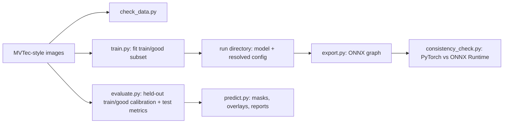
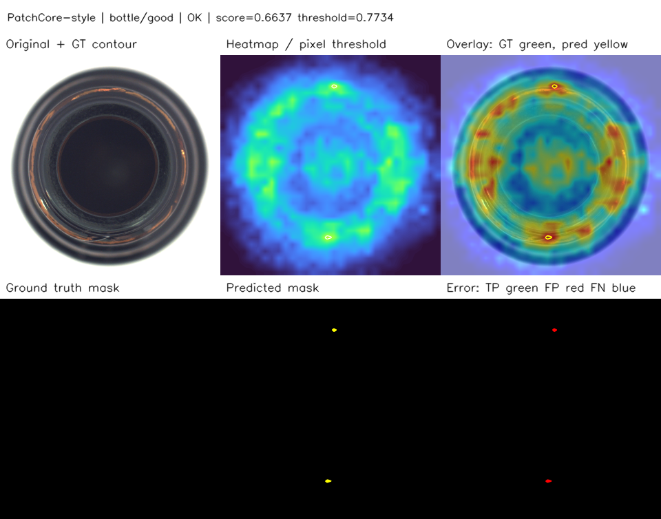
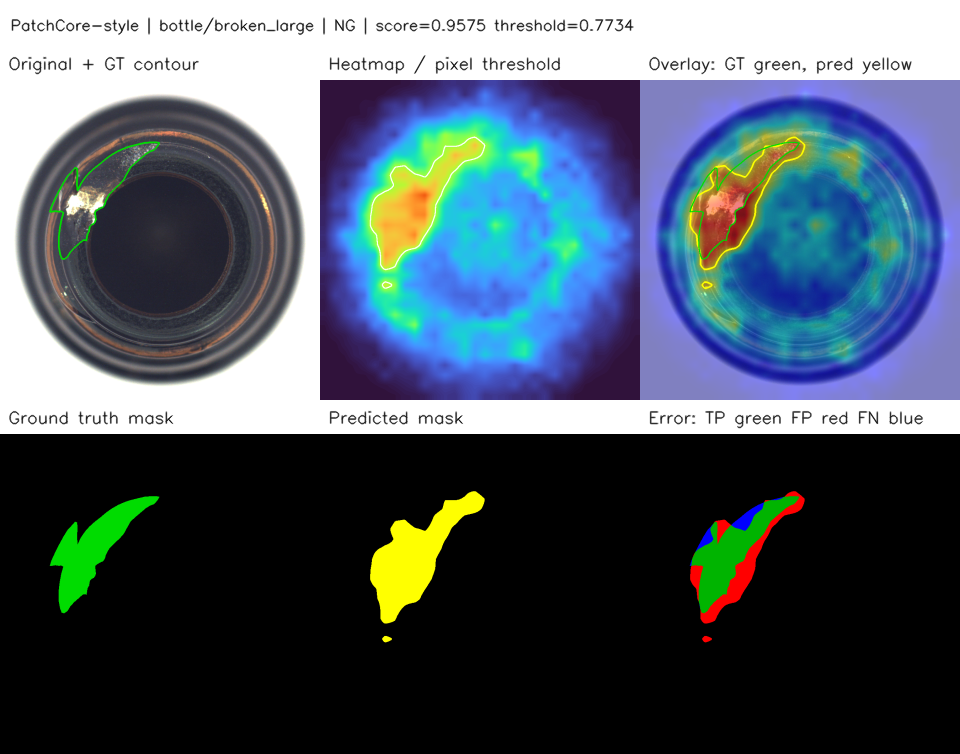
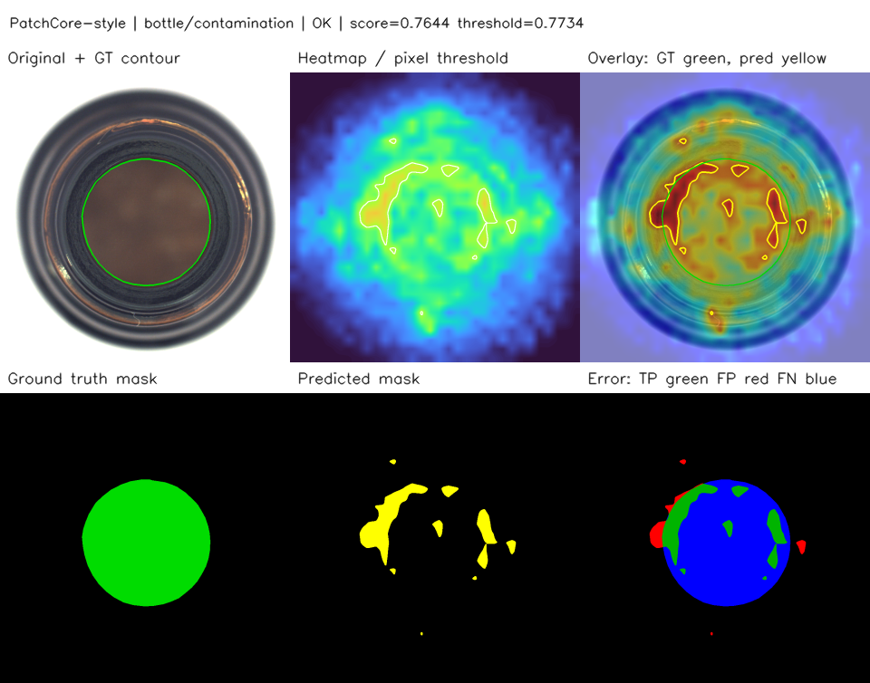
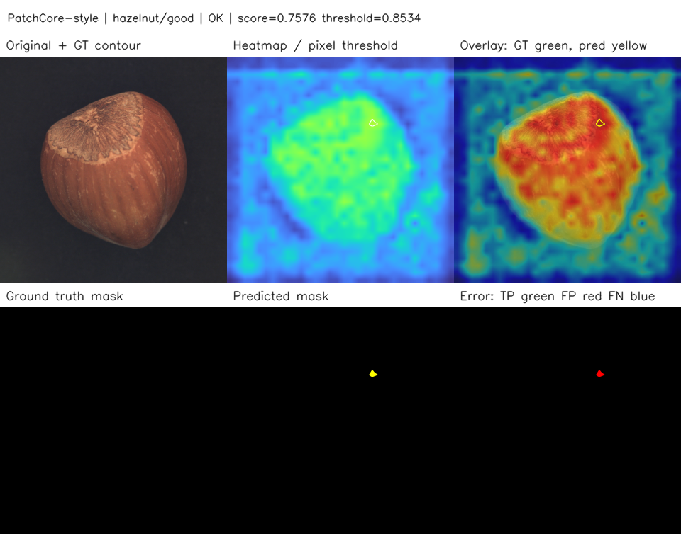
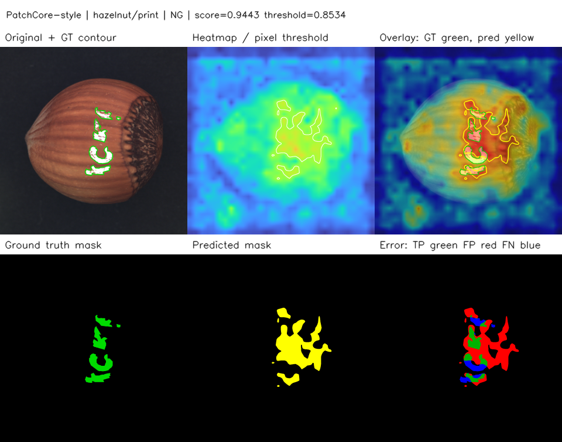
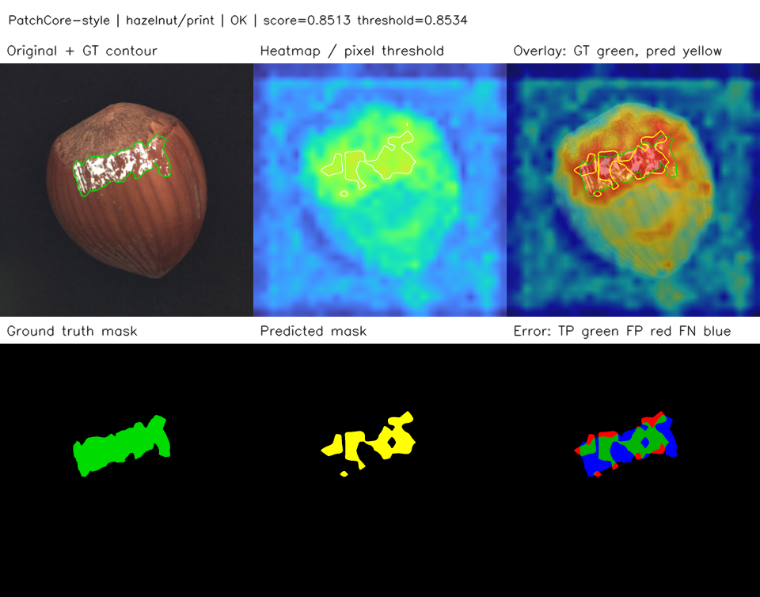
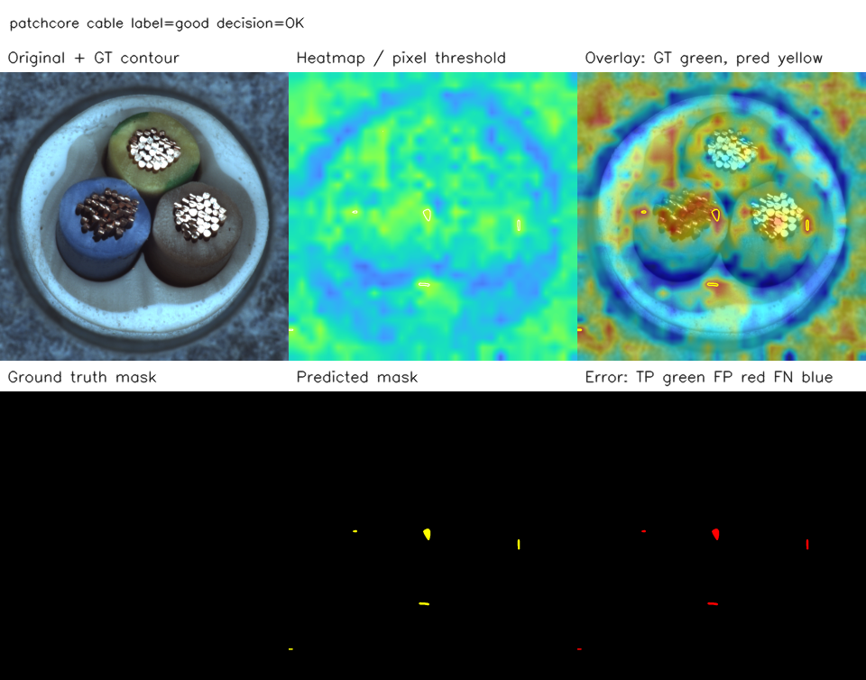
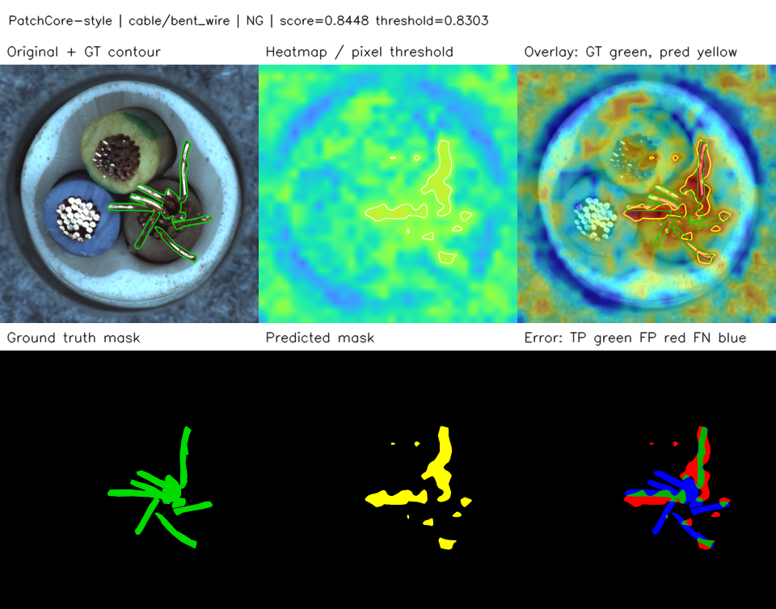
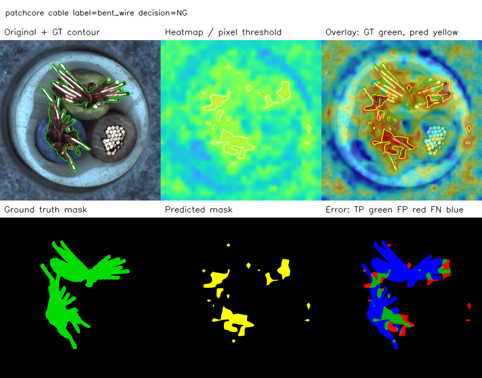

# AOI Anomaly Inspector

An end-to-end anomaly-detection portfolio project for MVTec AD-style industrial
images. It demonstrates data validation, good-only fitting, threshold
calibration, pixel and image evaluation, offline prediction, ONNX export, and
PyTorch-to-ONNX Runtime numerical parity checks on CPU. It is an educational
reference, not a production detector or a benchmark claim.


```mermaid
flowchart LR
    D[MVTec-style images] --> C[check_data.py]
    D --> T[train.py: fit train/good subset]
    T --> R[run directory: model + resolved config]
    D --> E[evaluate.py: held-out train/good calibration + test metrics]
    E --> P[predict.py: masks, overlays, reports]
    R --> X[export.py: ONNX graph]
    X --> V[consistency_check.py: PyTorch vs ONNX Runtime]
```

## What is implemented

| Detector | Canonical method | This repository's implementation |
|---|---|---|
| PaDiM | Per-location multivariate Gaussian with covariance modeling | PaDiM-style diagonal approximation: squared standardized feature distance using per-location mean and population standard deviation, with a `0.05` floor for finite one-image behavior and stable native/ONNX scoring. |
| PatchCore | Memory bank with greedy coreset selection and nearest-neighbour scoring | PatchCore-style random coreset approximation: deterministic sampled normalized patch bank and nearest-neighbour distance with a smooth near-zero transform for stable native/ONNX output. |

Both variants use a frozen ResNet-18 feature extractor. The saved model state
contains the exact backbone weights, selected channels, and fitted feature state;
loading never downloads weights or rebuilds random parameters.

## Setup and data layout

```bash
uv sync --dev
```

Expected MVTec-style layout:

```text
<data-root>/
  bottle/
    train/good/*.png
    test/good/*.png
    test/<defect_type>/*.png
    ground_truth/<defect_type>/*_mask.png
```

The repository includes a tiny offline fixture at `examples/mvtec_tiny`. This
is a functional smoke fixture, not a source of benchmark metrics.

Validate it with the command that was executed for this README:

```bash
uv run python scripts/check_data.py \
  --data-root examples/mvtec_tiny \
  --category bottle \
  --seed 0 \
  --preview-out /tmp/aoi-data-check-preview.png
```

## Executed CPU workflow

These commands were executed on the tracked tiny fixture. Replace the config,
data root, and category for a real local MVTec dataset.

```bash
uv run python scripts/train.py \
  --config configs/patchcore_tiny.yaml \
  --run-root /tmp/aoi-portfolio-smoke \
  --run-id documented

uv run python scripts/evaluate.py \
  --run-dir /tmp/aoi-portfolio-smoke/bottle/documented \
  --device cpu

uv run python scripts/export.py \
  --run-dir /tmp/aoi-portfolio-smoke/bottle/documented

uv run python scripts/consistency_check.py \
  --run-dir /tmp/aoi-portfolio-smoke/bottle/documented \
  --input-dir examples/mvtec_tiny/bottle/test

uv run python scripts/predict.py \
  --run-dir /tmp/aoi-portfolio-smoke/bottle/documented \
  --input-dir examples/mvtec_tiny/bottle/test \
  --output-dir /tmp/aoi-predict \
  --device cpu
```

`scripts/run_pipeline.py` orchestrates those four stateful stages when a single
command is useful:

```bash
uv run python scripts/run_pipeline.py \
  --config configs/patchcore_tiny.yaml \
  --consistency-input examples/mvtec_tiny/bottle/test \
  --run-root /tmp/aoi-pipeline \
  --run-id smoke \
  --device cpu
```

## Evaluation policy and metrics

Fitting and calibration read only `train/good`. The MVTec configurations use a
deterministic seed-based split: 80% fits the detector and 20% calibrates the
image and pixel thresholds. The resolved config, metadata, and
`thresholds.json` record the split policy and sample counts. Test images never
tune a threshold.

The two-image offline fixture intentionally uses shared normal samples
(`calibration_fraction: 0.0`) because it is a functional smoke test, not a
statistical evaluation. Runs with fewer than two normal images use the same
fallback and label it explicitly in `thresholds.json`.

- Image AUROC ranks image anomaly scores when both image classes exist.
- Pixel AUROC ranks anomaly-map pixels when both mask classes exist.
- Accuracy, precision, recall, F1, confusion counts, and pixel IoU use the
  fixed calibrated thresholds.
- Undefined one-class AUROC values are recorded as JSON `null` with a warning.

## Artifact contract

```text
<run-root>/<category>/<run-id>/
  config.yaml
  model.pt
  meta.json
  artifact_manifest.json
  thresholds.json
  metrics.json
  preds.jsonl
  report.json
  predictions/
    masks/
    overlays/
  samples/
  export/
    model.onnx
    export_meta.json
    consistency.json
```

Training creates the model, resolved config, metadata, and initial manifest.
Later stages atomically update their own manifest sections. `predict.py` writes
the same `masks/`, `overlays/`, `preds.jsonl`, and `report.json` schema to its
explicit output directory.

## ONNX deployment contract

The ONNX model has one dynamic-batch input and two outputs:

| Name | Shape | Meaning |
|---|---|---|
| `image` | `[B, 3, H, W]` float32 | RGB CHW pixels in `[0, 1]`; ImageNet normalization is embedded in the graph. |
| `anomaly_map` | `[B, 1, H, W]` float32 | Per-pixel anomaly map at the configured image size. |
| `pred_score` | `[B]` float32 | Maximum anomaly-map value per image. |

Decisions, thresholding, connected components, image decoding, and overlays
remain outside the graph.

The consistency check compares CPU PyTorch and ONNX Runtime outputs. It records
raw decision agreement, the number of scores within the configured absolute
tolerance of the threshold, and agreement on the remaining stable decisions.
The run fails on a stable decision mismatch; a near-threshold flip is reported
as an ambiguity instead of being silently folded into a passing claim.

## Reproducing verified MVTec AD results

The tracked assets are generated rather than hand-assembled. With a local MVTec
AD copy at `<data-root>`, run the pipeline once per category:

```bash
for category in bottle hazelnut cable; do
  uv run python scripts/run_pipeline.py \
    --config configs/patchcore_mvtec.yaml \
    --data-root <data-root> \
    --category "$category" \
    --consistency-input <data-root>/$category/test \
    --run-root /tmp/aoi-verified \
    --run-id verified \
    --device cpu
done

uv run python scripts/publish_results.py \
  --run-dir /tmp/aoi-verified/bottle/verified \
  --run-dir /tmp/aoi-verified/hazelnut/verified \
  --run-dir /tmp/aoi-verified/cable/verified
```

`publish_results.py` verifies model and ONNX hashes, requires a shared source
commit across runs, and regenerates `verified_results.json` plus the nine
diagnostic composites with fixed margin-based selection rules.


## Measured tiny-fixture consistency

The smoke fixture exercises the full export path and writes its exact map,
score, and decision-consistency values to `export/consistency.json`. It is not
used to claim detection quality.

## Verified MVTec AD results

The following results were generated with this repository's `run_pipeline.py`
on CPU using ResNet-18 `layer2`, `image_size=256`, seed `42`, and the tracked
PatchCore-style configuration. The 20% held-out normal calibration split was
fixed before test evaluation. Full metrics, thresholds, source commit, hashes,
consistency reports, selection policy, and selected source cases are recorded
in [`verified_results.json`](docs/assets/results/verified_results.json).

| Category | Image AUROC | Pixel AUROC | Image F1 | Pixel F1 | Pixel IoU |
|---|---:|---:|---:|---:|---:|
| bottle | 1.0000 | 0.9758 | 0.9587 | 0.6846 | 0.5204 |
| hazelnut | 0.8939 | 0.9629 | 0.2278 | 0.2247 | 0.1266 |
| cable | 0.8388 | 0.8343 | 0.1031 | 0.1472 | 0.0794 |

We report threshold-dependent F1 and IoU alongside AUROC. Low recall on a
category means that this normal-quantile operating point is not satisfactory
for that category; it is evidence to investigate calibration and model design,
not a deployment recommendation.

Each diagnostic composite shows the input with GT contour, a threshold-relative
heatmap, prediction overlay, ground-truth mask, predicted mask, and an error map
(TP green, FP red, FN blue).

### Bottle

| Normal case | Clear detected anomaly | Lowest-margin anomaly |
|---|---|---|
|  |  |  |

### Hazelnut

| Normal case | Clear detected anomaly | Lowest-margin anomaly |
|---|---|---|
|  |  |  |

### Cable

| Normal case | Clear detected anomaly | Lowest-margin anomaly |
|---|---|---|
|  |  |  |

## Verification and limitations

```bash
uv run pytest -v
```

The documented workflow was executed on CPU-only hardware. The detectors are
intentionally lightweight approximations, and their scores depend on the selected
backbone layer, random seed, training-normal coverage, image resizing, and
calibrated operating point. They require a local data-layout check and do not
replace production validation, inspection-system integration, or full canonical
PaDiM/PatchCore implementations.

## License

MIT. See `LICENSE`.
