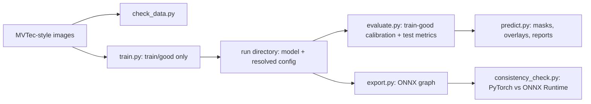

# AOI Anomaly Inspector

A CPU-first, end-to-end anomaly-detection portfolio project for MVTec AD-style
industrial images. It demonstrates data validation, good-only fitting,
threshold calibration, pixel and image evaluation, offline prediction, ONNX
export, and numerical deployment verification. It is an educational reference,
not a production detector or a benchmark claim.


```mermaid
flowchart LR
    D[MVTec-style images] --> C[check_data.py]
    D --> T[train.py: train/good only]
    T --> R[run directory: model + resolved config]
    R --> E[evaluate.py: train-good calibration + test metrics]
    E --> P[predict.py: masks, overlays, reports]
    R --> X[export.py: ONNX graph]
    X --> V[consistency_check.py: PyTorch vs ONNX Runtime]
```

## What is implemented

| Detector | Canonical method | This repository's implementation |
|---|---|---|
| PaDiM | Per-location multivariate Gaussian with covariance modeling | PaDiM-style diagonal approximation: squared standardized feature distance using per-location mean and population standard deviation, with a `0.05` floor for finite one-image behavior and stable native/ONNX scoring. |
| PatchCore | Memory bank with greedy coreset selection and nearest-neighbour scoring | PatchCore-style random coreset approximation: deterministic sampled normalized patch bank and nearest-neighbour distance. |

Both variants use a frozen ResNet-18 feature extractor. The saved model state
contains the exact backbone weights, selected channels, and fitted feature state;
loading never downloads weights or rebuilds random parameters.

## Setup and data layout

```bash
uv sync --dev
```

Expected MVTec-style layout:

```text
<data-root>/
  bottle/
    train/good/*.png
    test/good/*.png
    test/<defect_type>/*.png
    ground_truth/<defect_type>/*_mask.png
```

The repository includes a tiny offline fixture at `examples/mvtec_tiny`. This
is a functional smoke fixture, not a source of benchmark metrics.

Validate it with the command that was executed for this README:

```bash
uv run python scripts/check_data.py \
  --data-root examples/mvtec_tiny \
  --category bottle \
  --seed 0 \
  --preview-out /tmp/aoi-data-check-preview.png
```

## Executed CPU workflow

These commands were executed on the tracked tiny fixture. Replace the config,
data root, and category for a real local MVTec dataset.

```bash
uv run python scripts/train.py \
  --config configs/patchcore_tiny.yaml \
  --run-root /tmp/aoi-portfolio-smoke \
  --run-id documented

uv run python scripts/evaluate.py \
  --run-dir /tmp/aoi-portfolio-smoke/bottle/documented \
  --device cpu

uv run python scripts/export.py \
  --run-dir /tmp/aoi-portfolio-smoke/bottle/documented

uv run python scripts/consistency_check.py \
  --run-dir /tmp/aoi-portfolio-smoke/bottle/documented \
  --input-dir examples/mvtec_tiny/bottle/test

uv run python scripts/predict.py \
  --run-dir /tmp/aoi-portfolio-smoke/bottle/documented \
  --input-dir examples/mvtec_tiny/bottle/test \
  --output-dir /tmp/aoi-predict \
  --device cpu
```

`scripts/run_pipeline.py` orchestrates those four stateful stages when a single
command is useful:

```bash
uv run python scripts/run_pipeline.py \
  --config configs/patchcore_tiny.yaml \
  --consistency-input examples/mvtec_tiny/bottle/test \
  --run-root /tmp/aoi-pipeline \
  --run-id smoke \
  --device cpu
```

## Evaluation policy and metrics

Fitting reads only `train/good`. Evaluation calibrates the image and pixel
thresholds from those same normal training scores, then applies the fixed
thresholds to the test split. Test images never tune a threshold.

- Image AUROC ranks image anomaly scores when both image classes exist.
- Pixel AUROC ranks anomaly-map pixels when both mask classes exist.
- Accuracy, precision, recall, F1, confusion counts, and pixel IoU use the
  fixed calibrated thresholds.
- Undefined one-class AUROC values are recorded as JSON `null` with a warning.

## Artifact contract

```text
<run-root>/<category>/<run-id>/
  config.yaml
  model.pt
  meta.json
  artifact_manifest.json
  thresholds.json
  metrics.json
  preds.jsonl
  report.json
  predictions/
    masks/
    overlays/
  samples/
  export/
    model.onnx
    export_meta.json
    consistency.json
```

Training creates the model, resolved config, metadata, and initial manifest.
Later stages atomically update their own manifest sections. `predict.py` writes
the same `masks/`, `overlays/`, `preds.jsonl`, and `report.json` schema to its
explicit output directory.

## ONNX deployment contract

The ONNX model has one dynamic-batch input and two outputs:

| Name | Shape | Meaning |
|---|---|---|
| `image` | `[B, 3, H, W]` float32 | RGB CHW pixels in `[0, 1]`; ImageNet normalization is embedded in the graph. |
| `anomaly_map` | `[B, 1, H, W]` float32 | Per-pixel anomaly map at the configured image size. |
| `pred_score` | `[B]` float32 | Maximum anomaly-map value per image. |

Decisions, thresholding, connected components, image decoding, and overlays
remain outside the graph.

## Measured tiny-fixture consistency

The executed PatchCore-style run above compared two test images on CPU. It
passed the configured maximum/mean tolerances of `1e-4` / `1e-5`, with map
errors `1.27e-6` max and `2.49e-7` mean, score errors `7.75e-7` max and
`5.07e-7` mean, and decision agreement `1.0`.

## Qualitative results

The tiny fixture demonstrates that artifacts, masks, overlays, and deployment
paths work together. It is intentionally too small to support qualitative or
performance claims; use a complete local category and inspect the generated
`samples/` and `predictions/` artifacts for qualitative review. Historical
result images without reproducible source artifacts are intentionally not kept.

## Verification and limitations

```bash
uv run pytest -v
```

The documented path is CPU-first. The detectors are intentionally lightweight
approximations, and their scores depend on the selected backbone layer, random
seed, training-normal coverage, image resizing, and calibrated operating point.
They do not replace production validation, inspection-system integration, or
full canonical PaDiM/PatchCore implementations.

## License

MIT. See `LICENSE`.
